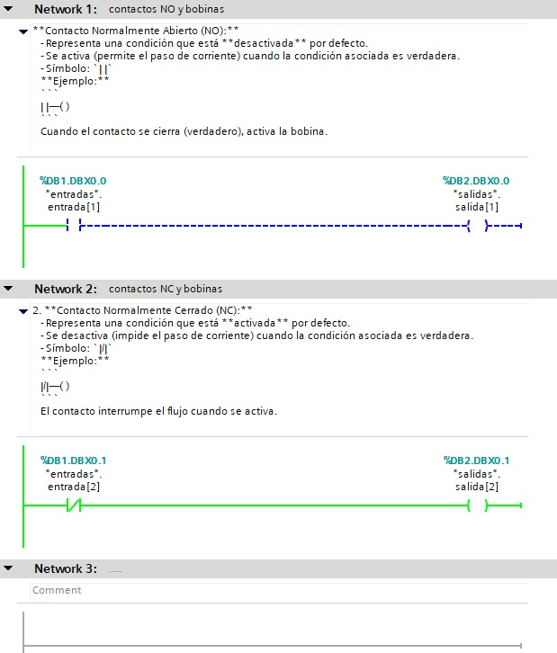

# Contactos y Bobinas en Lenguaje Ladder 🔧

El lenguaje **Ladder** o diagrama de escalera es un método gráfico de programación usado principalmente en sistemas de control con PLC (Controladores Lógicos Programables). Dos de los elementos más comunes en este lenguaje son los **contactos** y las **bobinas**, fundamentales para representar el comportamiento lógico de un sistema.
---
Ejemplo en TIA PORTAL al final + archivo adjunto en TIA PORTAL V16
---

## 🤝 Contactos

Los contactos representan las condiciones o entradas que activan un circuito en el diagrama Ladder. Pueden estar asociados a entradas físicas (sensores, botones) o variables internas del PLC.

### Tipos de Contactos

1. **Contacto Normalmente Abierto (NO):**
   - Representa una condición que está **desactivada** por defecto.
   - Se activa (permite el paso de corriente) cuando la condición asociada es verdadera.
   - Símbolo: `| |`

   **Ejemplo:**
   ```
   | |----( )
   ```
   Cuando el contacto se cierra (verdadero), activa la bobina.

2. **Contacto Normalmente Cerrado (NC):**
   - Representa una condición que está **activada** por defecto.
   - Se desactiva (impide el paso de corriente) cuando la condición asociada es verdadera.
   - Símbolo: `|/|`

   **Ejemplo:**
   ```
   |/|----( )
   ```
   El contacto interrumpe el flujo cuando se activa.

---

## 🔄 Bobinas

Las bobinas representan las salidas del sistema o variables internas que se activan o desactivan según las condiciones del circuito Ladder. Están asociadas a dispositivos como relés, actuadores o señales internas del PLC.

### Tipos de Bobinas

1. **Bobina de Activación:**
   - Activa una salida cuando la condición lógica anterior es verdadera.
   - Símbolo: `( )`

   **Ejemplo:**
   ```
   | |----( )
   ```
   Si el contacto está cerrado, la bobina se activa.

2. **Bobina de Desactivación:**
   - Desactiva una salida cuando la condición lógica anterior es verdadera.
   - Símbolo: `(!)`

   **Ejemplo:**
   ```
   | |----(!)
   ```
   Si el contacto está cerrado, la bobina se desactiva.

3. **Bobina Retentiva:**
   - Mantiene su estado (activado o desactivado) incluso si las condiciones cambian.
   - Utilizada para memorizar estados.

   **Ejemplo:**
   ```
   | |----[Set]
   | |----[Reset]
   ```

---

## 🖇️ Ejemplo Completo

Un sistema básico en Ladder puede representarse de la siguiente forma:

```ladder
| Start Button |    Motor Output
     | |--------------( )
```
- El motor se activa cuando se presiona el botón de inicio (Start Button).

```ladder
| Stop Button |    Motor Output
     |/|--------------(!)
```
- El motor se detiene cuando se presiona el botón de parada (Stop Button).

---



Se adjunto archivo (.zap16) del codigo  solo hay que descargarlo y abrirlo con TIA PORTAL V16 o superior.

---
El lenguaje Ladder es una herramienta poderosa y accesible para diseñar y entender sistemas lógicos en la automatización industrial. ¡Aprender su lógica básica es clave para trabajar con PLCs! 🚀

> 💡 *"Un buen diseño en Ladder es claro, eficiente y fácil de mantener."*
