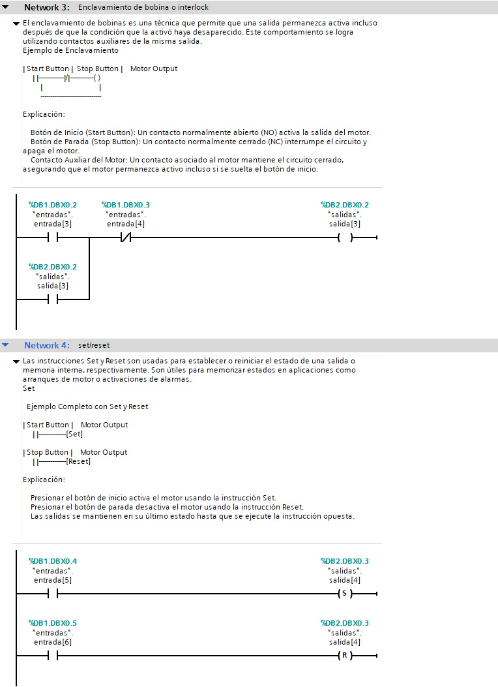

# Enclavamiento de Bobinas e Instrucción Set/Reset en Lenguaje Ladder 🔒

El lenguaje **Ladder** es ampliamente utilizado en la programación de PLCs para sistemas de control. Dos conceptos importantes son el **enclavamiento de bobinas** y el uso de las instrucciones **Set/Reset** para controlar salidas y memorizar estados.

---

## 🔄 Enclavamiento de Bobinas (Latching)

El enclavamiento de bobinas es una técnica que permite que una salida permanezca activa incluso después de que la condición que la activó haya desaparecido. Este comportamiento se logra utilizando contactos auxiliares de la misma salida.

### Ejemplo de Enclavamiento

```ladder
| Start Button |  Stop Button |    Motor Output
     | |-------------|/|------------( )
         |                             |
         -------------------------------
```

### Explicación:
1. **Botón de Inicio (Start Button):** Un contacto normalmente abierto (NO) activa la salida del motor.
2. **Botón de Parada (Stop Button):** Un contacto normalmente cerrado (NC) interrumpe el circuito y apaga el motor.
3. **Contacto Auxiliar del Motor:** Un contacto asociado al motor mantiene el circuito cerrado, asegurando que el motor permanezca activo incluso si se suelta el botón de inicio.

---

## 🔧 Instrucciones Set y Reset

Las instrucciones **Set** y **Reset** son usadas para establecer o reiniciar el estado de una salida o memoria interna, respectivamente. Son útiles para memorizar estados en aplicaciones como arranques de motor o activaciones de alarmas.

### Set
- Activa la salida o memoria y mantiene su estado incluso si la condición desaparece.
- Símbolo: `[Set]`

```ladder
| Start Button |    Motor Output
     | |--------------[Set]
```

### Reset
- Desactiva la salida o memoria independientemente del estado previo.
- Símbolo: `[Reset]`

```ladder
| Stop Button |    Motor Output
     | |--------------[Reset]
```

---

## 🖇️ Ejemplo Completo con Set y Reset

```ladder
| Start Button |    Motor Output
     | |--------------[Set]

| Stop Button |    Motor Output
     | |--------------[Reset]
```

### Explicación:
1. Presionar el botón de inicio activa el motor usando la instrucción **Set**.
2. Presionar el botón de parada desactiva el motor usando la instrucción **Reset**.
3. Las salidas se mantienen en su último estado hasta que se ejecute la instrucción opuesta.

---

## 🛠️ Comparación: Enclavamiento vs. Set/Reset

| **Aspecto**           | **Enclavamiento**                    | **Set/Reset**                    |
|-----------------------|--------------------------------------|----------------------------------|
| **Memoria de estado** | Requiere contactos auxiliares        | Interna al PLC                   |
| **Simplicidad**       | Más visual en Ladder                | Menos visual, más estructurado  |
| **Usos comunes**      | Circuitos básicos, arranques manuales| Sistemas complejos, alarmas     |

---




Se adjunto archivo (.zap16) del codigo solo hay que descargarlo y abrirlo con TIA PORTAL V16 o superior.

---

Ambas técnicas son fundamentales en el diseño de sistemas Ladder y ofrecen flexibilidad para cubrir una amplia variedad de aplicaciones. ¡Dominar su uso es esencial para cualquier programador de PLC! 🚀

> 💡 *"El control eficiente comienza con una lógica clara."*
