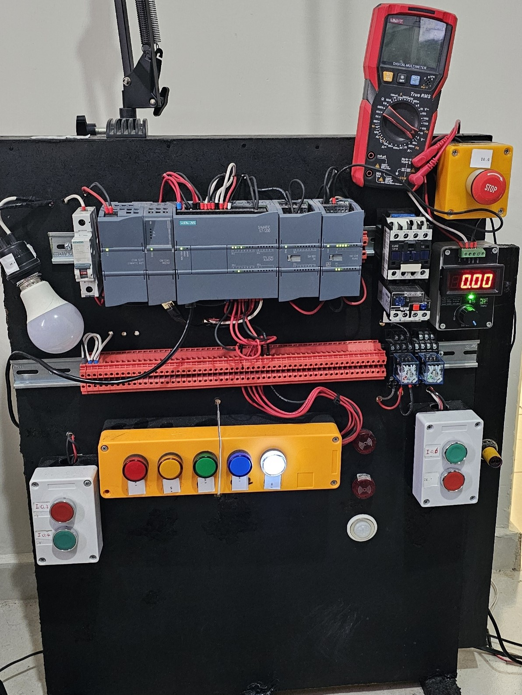
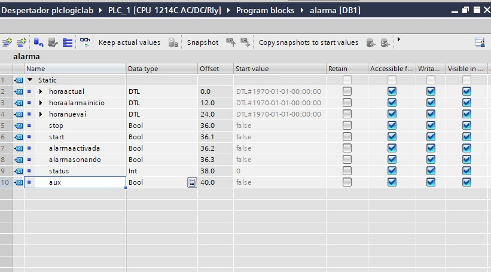
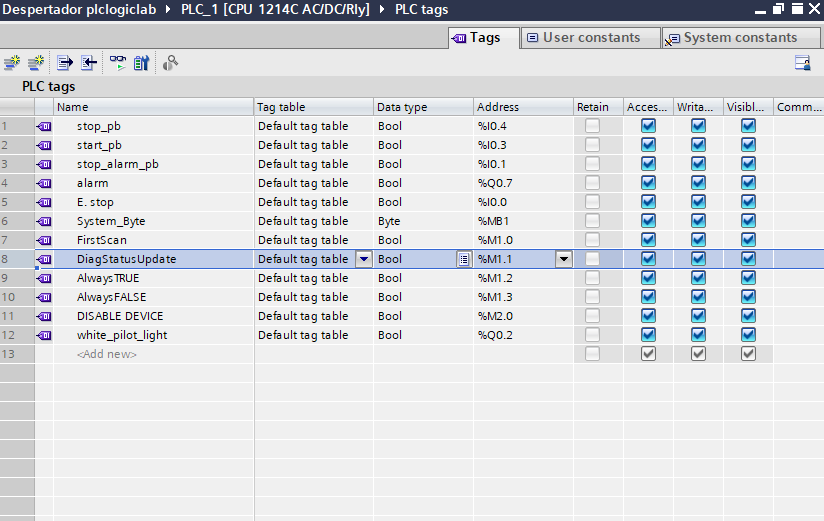

# Alarma diaria que desactiva un dispositivo 🔧

El proposito de este proyecto es deshabilitar un dispositivo que este siempre conectado y que se deshabilite solo mientras la alarma este activa.
Se utilizo el siguiente hardware y software:

##

-TIA PORTAL V16

-PLCSIM

-Cable de red ethernet

-PLC SIEMENS S71200 1214C AC/DC/RLY

-Pulsadores y luces piloto 120VCA

-Lenguaje ladder

# Tablero de pruebas

##

#Tags del plc y DB's empleados

##
Adjunte el archivo del proyecto
